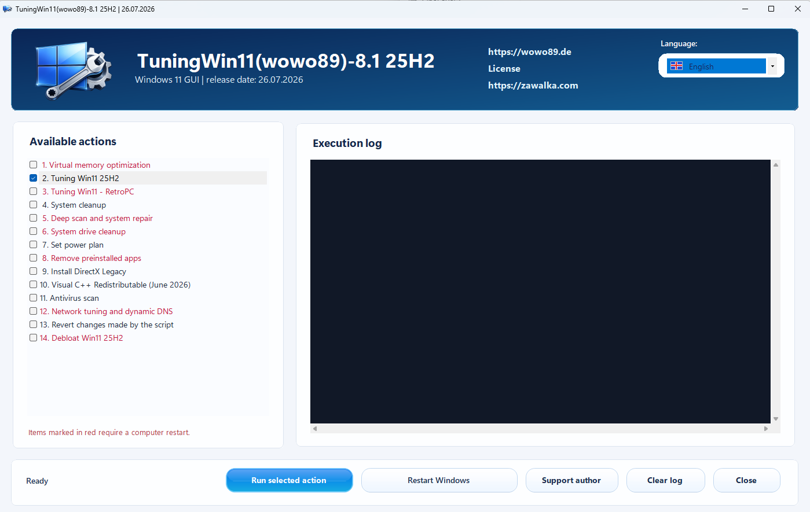
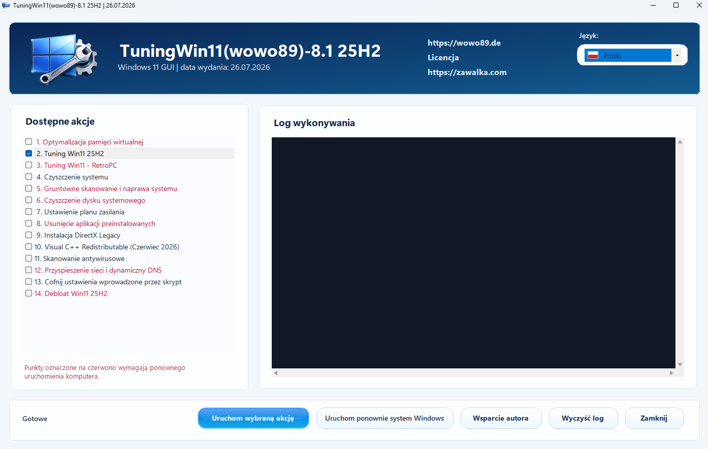
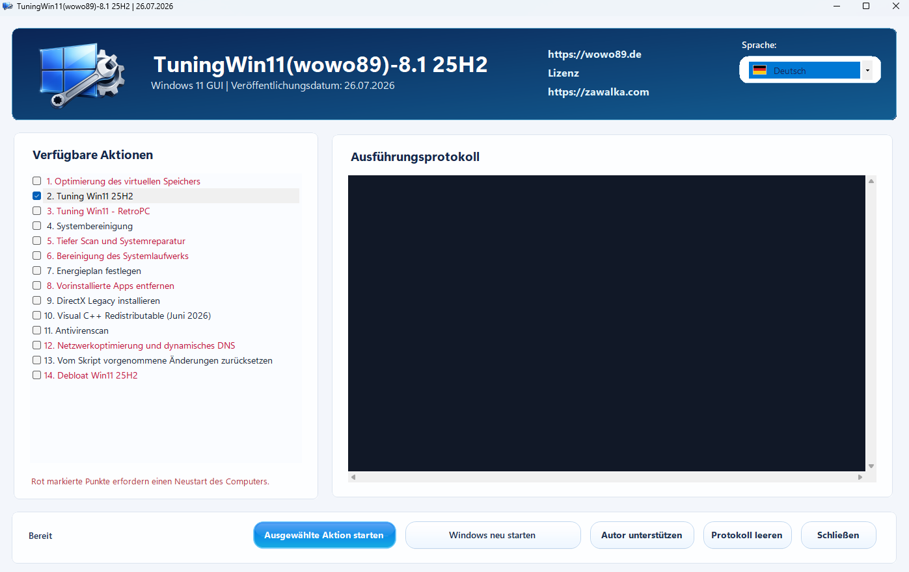

# TuningWin11(wowo89) 8.1 25H2

**TuningWin11(wowo89)** is a Windows 11 tuning and maintenance utility focused on Windows 11 25H2 systems. It combines a graphical interface with a curated set of system maintenance, cleanup, repair, runtime installation, debloat, network, power-plan and rollback actions.

The project has been continuously developed for about two years. Until now, it was shared mainly through Polish discussion forums and community feedback. Version 8.1 is the first release prepared for a wider international audience, with a multilingual interface and a more polished distribution package.

> Use this tool with care. It changes Windows settings and can remove or disable selected system features. Create a restore point before applying system-wide tweaks.

## Screenshots

### English interface

### Polish interface

### German interface

## What It Does

TuningWin11(wowo89) 8.1 provides a structured set of actions for Windows 11 25H2, including:

- virtual memory optimization,
- Windows 11 tuning profile for 25H2,
- RetroPC mode for weaker hardware,
- system cleanup and Windows Update cache reset,
- DISM, SFC and disk repair workflows,
- system disk cleanup,
- power plan configuration,
- optional debloat of preinstalled applications,
- DirectX Legacy installation,
- Visual C++ Redistributable installation,
- antivirus scan workflow,
- network and dynamic DNS optimization,
- rollback of selected script changes,
- Windows 11 25H2 debloat profile.

## Version 8.1 Highlights

Version 8.1 focuses on safer Windows 11 25H2 behavior and fixes reported by users of version 8.0:

- Windows Search indexing is kept active to prevent the Start menu warning about disabled indexing.
- Microsoft Phone Link / Smartphone-Link compatibility was restored and protected during debloat.
- Debloat now asks whether Phone Link should be preserved or removed.
- Windows Update policies were adjusted so updates are no longer blocked by organization/group-policy style restrictions unless the user explicitly chooses manual-only update behavior.
- A Windows Update repair script was added to remove problematic update-blocking entries from previous versions.
- Visual C++ Redistributable packages were updated to the June 2026 set.
- System cleanup and deep repair actions were separated more clearly to avoid duplicated work.
- The GUI now includes clickable project links and an embedded multilingual license window.

## Languages

The application interface supports:

- Polish,
- English,
- German.

At startup, the application tries to match the Windows system language. If the system language is not supported, it falls back to English.

## Download

The complete ready-to-use package is available from the GitHub release:

- **TuningWin11-wowo89-8.1-25H2.zip**

After downloading, extract the ZIP archive and run **TuningWin11.exe** as administrator.

## Requirements

- Windows 11 25H2,
- administrator privileges,
- internet access for features that download or install external components,
- a system restore point is strongly recommended before applying changes.

## Important Notes

Some actions may require a system restart. The application marks restart-sensitive actions in the interface.

The tool may change system services, registry values, Windows Update behavior, privacy settings, background apps, power configuration, network settings and installed Windows components depending on the selected actions.

## License

TuningWin11(wowo89) is free for private, non-commercial use only. Commercial use requires a paid commercial license from the author.

Modification, rebranding, decompilation, repackaging and redistribution of modified versions are not permitted without written permission from the author.

The full license text is available in [LICENSE.txt](LICENSE.txt) and is also embedded in the application.

## Author

**WoWo89 / Piotr Zawalka**

- Website: <https://wowo89.de>
- Website: <https://zawalka.com>

## Disclaimer

This software is provided as-is, without warranty of any kind. You use it entirely at your own risk. The author is not responsible for data loss, system instability, configuration loss, downtime or any other consequences resulting from the use or inability to use the software.